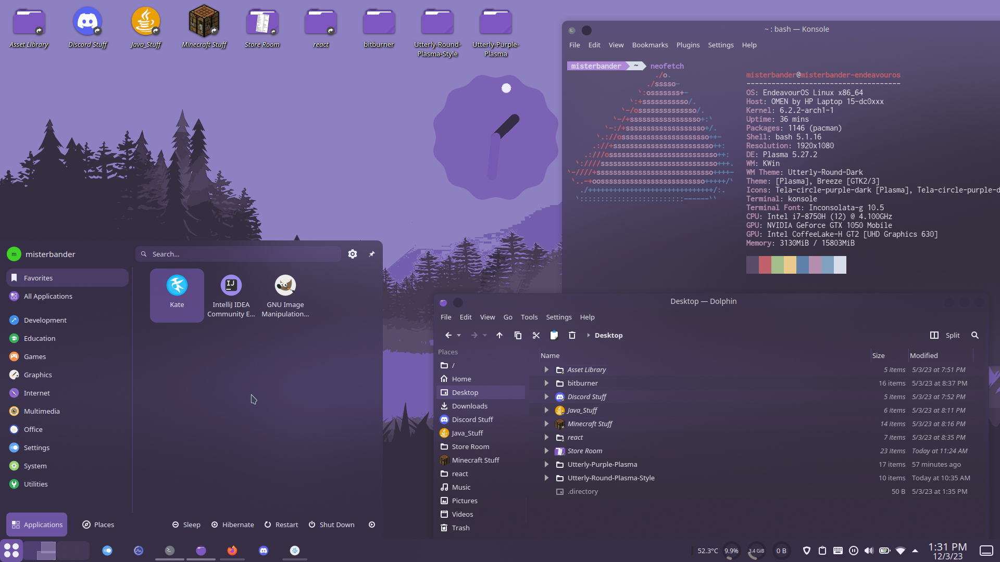
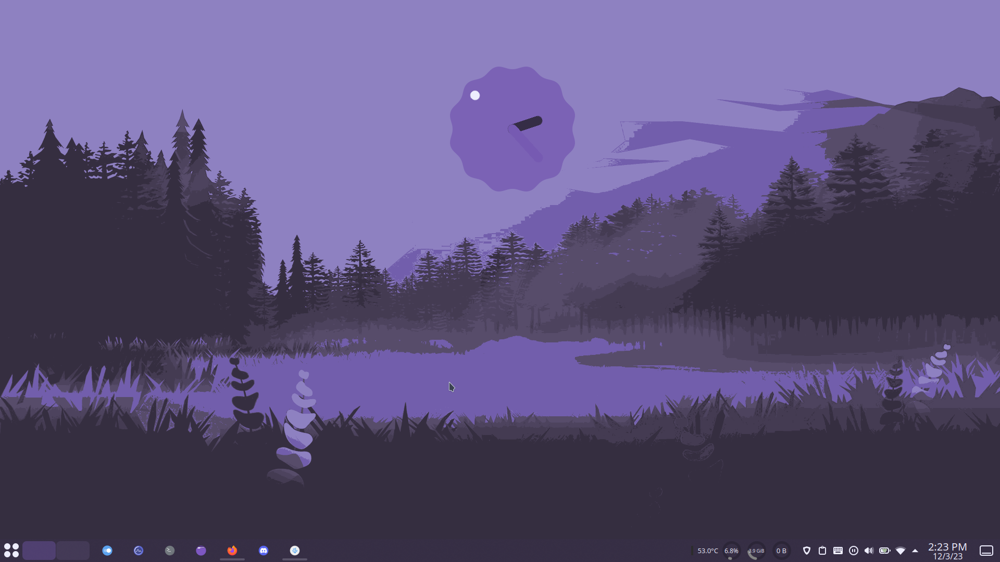
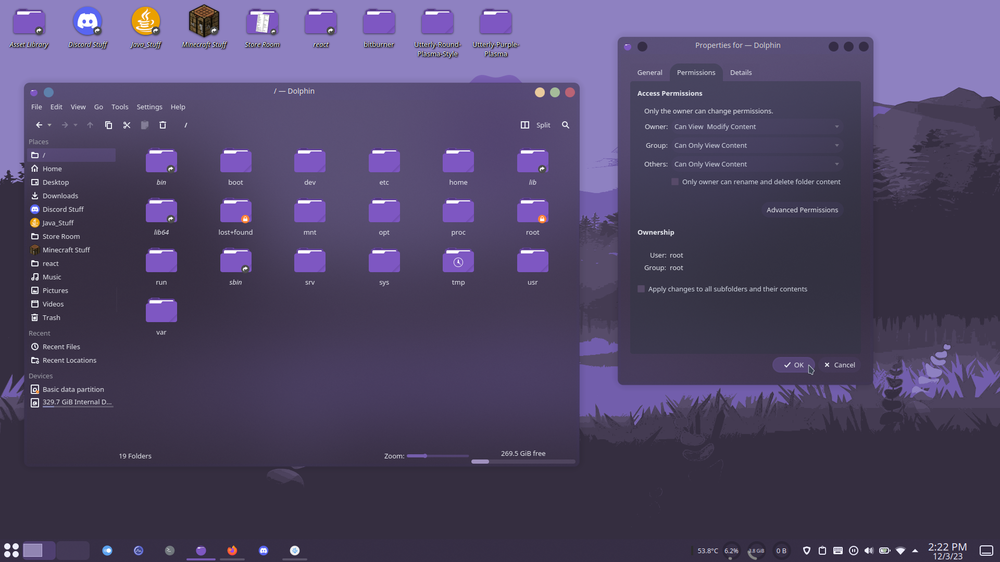
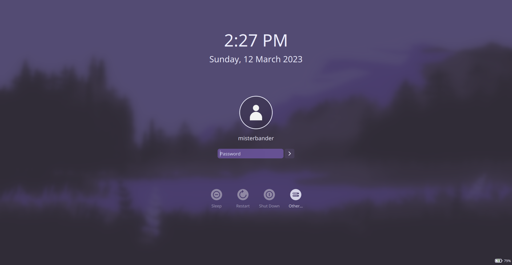

# Utterly Purple Dark Plasma Global Theme

## Modified [Utterly Nord](https://github.com/HimDek/Utterly-Nord-Plasma) theme for Plasma 5



This is a fork of [HimDek/Utterly-Nord-Plasma](https://github.com/HimDek/Utterly-Nord-Plasma), a global theme for Plasma 5 modified to have the purple color scheme.

I am lazy, therefore this fork only contains modified versions of the Utterly Nord dark theme, the light theme is unchanged and is identical to the one in Utterly Nord.

Enjoy!

## The following themes are modified:

* Plasma style (`look-and-feel`)
* SDDM theme
* Kvantum theme
* Wallpaper
* Splash screen
* Plasma color scheme (`UtterlyPurple.colors`)
* Konsole color scheme (`Utterly Purple.colorscheme`)

## Installation

1. Install [Utterly Round Plasma Style](https://github.com/HimDek/Utterly-Round-Plasma-Style).

2. Install `kvantum`.

3. Install the **Tela circle purple dark** icon theme.

`System Settings > Appearance > Icons > Get New Icons > ` Search for `'Tela circle icon theme'` and select `Tela-circle-purple.tar.gz`

4. Run the `install.sh` script.

```bash
cd [project folder]
./install.sh
```

5. Apply the global theme.

`System Settings > Appearance > Global Theme > Utterly Purple`

6. Apply kvantum theme.

`System Settings > Appearance > Application Style > ` Select `kvantum-dark`

Open `Kvantum Manager > Change/Delete Theme > ` Select `Utterly-Purple`

7. Apply SDDM theme.

> **NOTE:** SDDM (the **login screen** that you see **at startup**, **NOT** the screen that you see when you lock your computer) needs to have its theme applied separately.

`System Settings > Workspace > Startup and Shutdown > Login Screen (SDDM) > ` Select `Utterly-Purple > Apply`


Click `Apply Plasma Settings` to make SDDM pull your theme configurations from Plasma.

> **NOTE:** Sometimes even after clicking `Apply Plasma Settings`, the SDDM theme still has components in your old plasma style (breeze or whatever your previous plasma style was) and not Utterly-Round. If this happens, try manually reapplying the **Utterly Round** plasma style (`System Settings > Global Theme > Plasma Style` select a random theme, hit apply, then select **Utterly Round** again), then click on `Apply Plasma Settings` again. I have no idea why this happens, but this seems to work.

## Gallery






